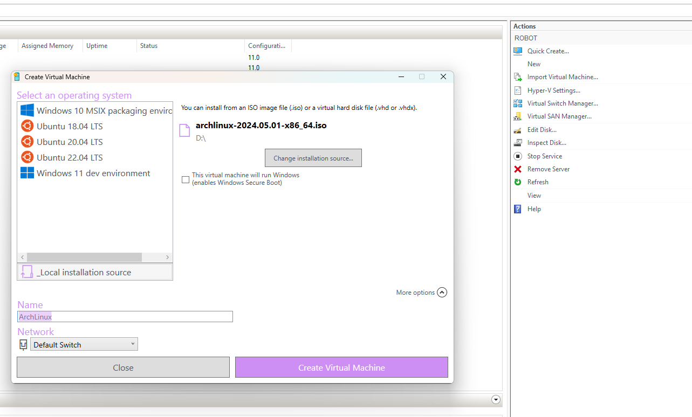
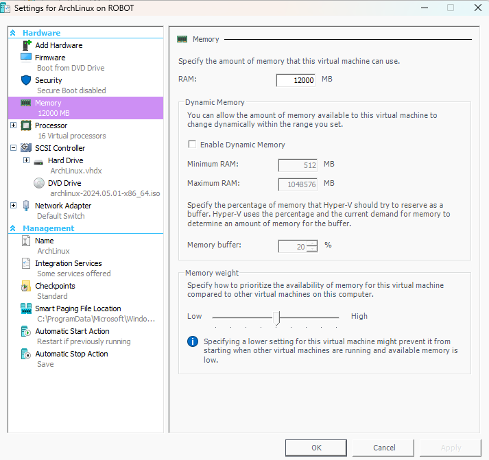
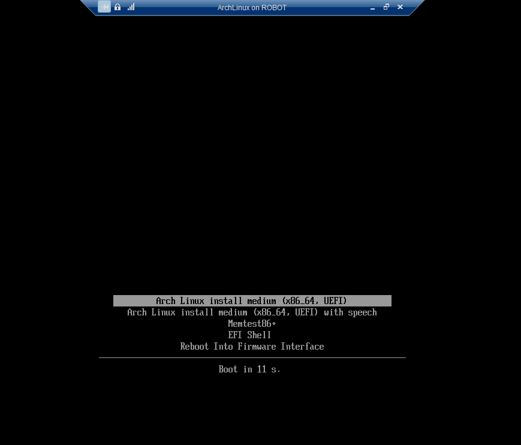
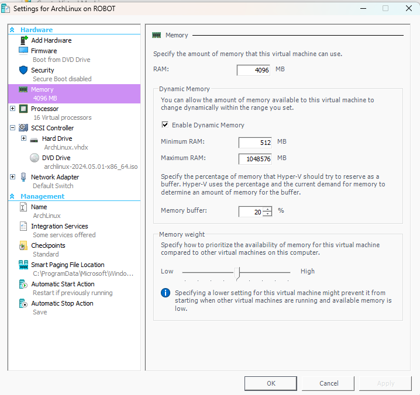
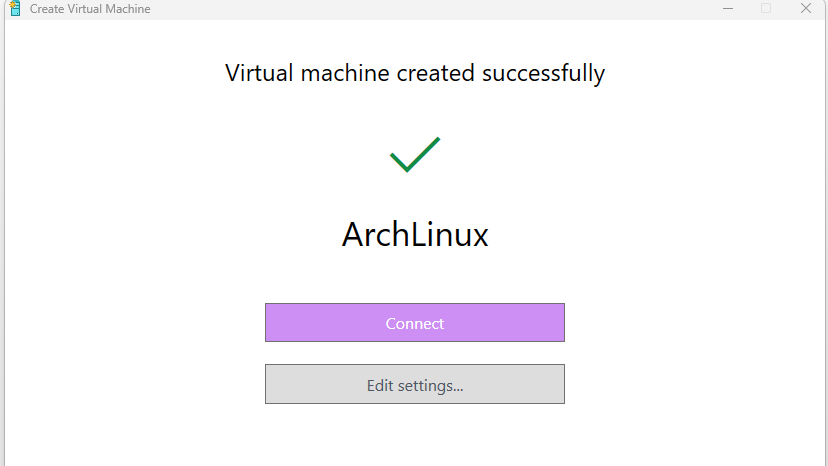

# Arch Linux Setup on Hyper-V 🖥️🐧

## Overview
This guide will help you set up an Arch Linux virtual machine on Hyper-V with enhanced session mode and custom configurations. Follow the steps below to create, configure, and customize your Arch Linux VM.
- NOTE: By default right now the root user and your username will use `password` as the default password.

## Prerequisites
- Hyper-V installed on your host machine
- Basic knowledge of Hyper-V and command-line usage

## Step-by-Step Guide

### 1. Creating the Arch Linux VM 🛠️
First, create an Arch Linux VM in Hyper-V. Refer to the images in the `readme_images` folder for visual guidance:

1. **Quick Create** ✨

   
   Use the Quick Create feature in Hyper-V to create a new VM.

3. **RAM Allocation** 🧠

   
   Allocate the desired amount of RAM to your VM.

### 2. Pre-Boot Configuration ⚙️
Before booting the VM, enable host support for enhanced session mode:

```powershell
Set-VM -VMName "ArchLinux" -EnhancedSessionTransportType HvSocket
```
Replace `"ArchLinux"` with the name of your VM.

**First Boot** 🚀
   
   
   Boot the VM for the first time and proceed with the Arch Linux installation.

### 3. Initial Setup 🏁
Run the initial setup script to install Arch Linux:

```bash
curl https://raw.githubusercontent.com/pentestfunctions/archsetup/main/setup.sh > setup.sh
chmod +x setup.sh
./setup.sh
```

This script will install Arch Linux and reboot the VM.

### 4. Post-Installation Configuration 🛠️
After rebooting, log in with the default credentials (`username:password`), then proceed with the following steps:

1. **Clone the Setup Repository** 📂
   ```bash
   git clone https://github.com/pentestfunctions/archsetup.git
   cd archsetup
   ```

2. **Configure Hyper-V Enhanced Mode** 🖥️
   ```bash
   chmod +x hypervsetup.sh
   ./hypervsetup.sh
   ```

   Reboot the system after running this script. Connect using the enhanced RDP session prompt.

### 5. Customization 🎨
Customize your Arch Linux setup with the provided script:

1. **Run the Customization Script** 🛠️
   ```bash
   cd archsetup
   chmod +x customize.sh
   ./customize.sh
   ```

   
   Follow the prompts to customize your setup.

2. **Edit Settings** ⚙️
   
   Adjust any additional settings as needed.

### 6. Install Essential Tools 🛠️
Finally, install essential tools and applications:

```bash
yay -S nano lolcat brave --noconfirm
```

### 7. Install my toolset or you can install your own 🧰
After the tools are installed, you can rerun this script and everything should be green.

```bash
chmod +x install_tools.sh
./install_tools.sh
```
Close and relaunch your terminal to apply transparency settings if configured.

## WoooHooo! 🎉
Your Arch Linux VM on Hyper-V is now set up with enhanced session mode and customized settings. You can start installing and configuring additional tools as per your requirements. Enjoy your new Arch Linux environment! 🚀


